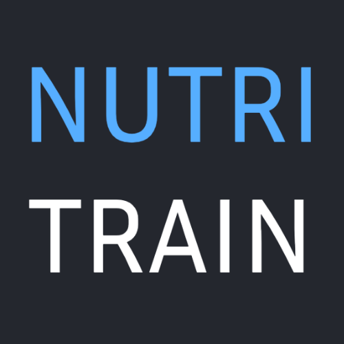
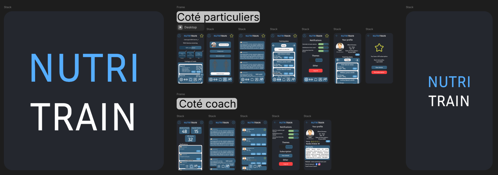

# 🏋️‍♂️ NutriTrain – Votre coach intelligent pour un suivi sportif optimal

  

**NutriTrain** est une application innovante qui optimise votre entraînement et votre nutrition grâce à l'intelligence artificielle. Elle aide les sportifs de tous niveaux à **suivre leur progression, adapter leurs entraînements en cas de blessure, gérer leur nutrition et interagir avec leur coach**.

---

## 🚀 Fonctionnalités principales  

✅ **Suivi des entraînements** : Enregistrez vos séances, suivez vos performances avec des graphiques détaillés 📊.  
✅ **Adaptation en cas de blessure** : Une IA propose des exercices alternatifs et des conseils pour éviter d'aggraver une blessure 🏥.  
✅ **Suivi des calories et nutrition** : Un outil intégré permet de compter les calories et d'adapter votre alimentation 🍽️.  
✅ **Chat coach-client & communauté** : Échangez avec votre coach et d'autres pratiquants pour progresser ensemble 💬.  
✅ **Programmes personnalisés** : Création et suivi d’entraînements adaptés à vos objectifs 🎯.  

---

## 📸 Aperçu de l'application  

   

---

## 🎯 Pourquoi utiliser NutriTrain ?  

📉 **Évitez l’abandon** : 50% des nouveaux pratiquants arrêtent par manque de résultats, **NutriTrain vous garde motivé**.  
🔍 **Précision et adaptation** : Grâce à une IA développée avec des professionnels de la santé.  
🛠 **Un tout-en-un** : Plus besoin d’utiliser plusieurs applications pour le sport, la nutrition et le coaching.  

---

## 🏆 Pour qui est NutriTrain ?  

- **Sportifs débutants** 🎽 : Pour structurer leur entraînement et améliorer leur nutrition.  
- **Sportifs intermédiaires** 🏋️ : Pour optimiser leurs performances et progresser.  
- **Sportifs blessés** 🏥 : Pour adapter leurs entraînements et accélérer leur rétablissement.  
- **Coachs sportifs** 👨‍🏫 : Pour gérer leurs clients et leur progression efficacement.  

---

## 🛠 Installation & Utilisation  

1. **Cloner le projet**  
   ```bash
   git clone https://github.com/EpitechPromo2027/G-EIP-600-MAR-6-1-eip-evan.frasca.git
2. **Lancer le projet**  
   ```bash
   ./run.sh

## 📬 Contact
- 📧 **Evan Frasca** - evan.frasca@epitech.eu
- 📧 **Naem Meddour** - naem.meddour@epitech.eu
- 📧 **Rayan Bahri** - rayan.bahri@epitech.eu

## 🚀 Prêt à booster votre progression avec NutriTrain ? 🔥
